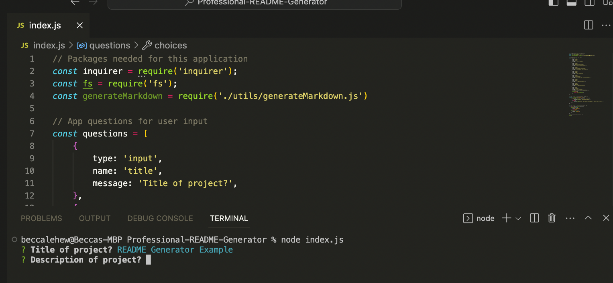
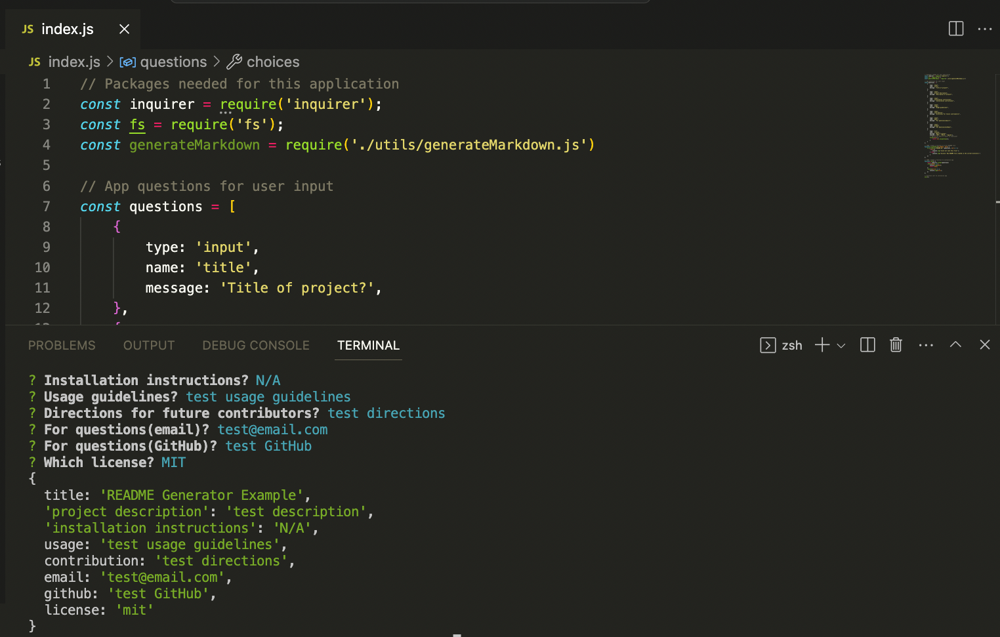

# Professional README Generator

## Description:

A command-line application that dynamically generates a professional README.md file from a user's input using the Inquirer package.

## Usage:

This app allows a user to generate a quality README file using the Inquirer package in the command line. The README file is generated within the current directory. The app prompts the user to input all the information necessary to create a high quality readme for any project.

## Future Contributions:
- Fork the repo to make personal changes
- Add additional license options

## Questions:
For questions, contact me at:
- email: lehew316@gmail.com
- GitHub: https://www.github.com/rebeccalehew
- Project GitHub Repository: https://github.com/rebeccalehew/Professional-README-Generator
- Video Demo: 

## Resources:
- https://www.youtube.com/@Assistian
- https://www.npmjs.com/package/inquirer/v/8.2.4
- https://www.geeksforgeeks.org/node-js-fs-writefile-method/
- https://www.w3schools.com/js/js_switch.asp